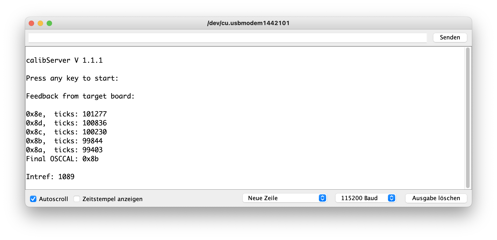

# AVR MCU Calibration

This library contains just one function to set user calibration values in a (classic) AVR MCU and two sketches that can be used to determine the calibration values by connecting a target board to an Arduino UNO (or a similar board) using an ICSP cable. It depends on the [*Vcc* library](https://github.com/felias-fogg/Vcc), which you need to install as well (either by using the library manager or by downloading it from GitHub).

### Purpose

If you use a crystal, a ceramic resonator, or an external oscillator, the MCU clock frequency is most probably very accurate, usually better than 0.1%. This means, the MCU can be used for timing purposes and it can communicate asynchronously. However, if you are relying on the internal RC oscillator, the guaranteed accuracy is often much worse. For some MCUs, only ±10% is guaranteed. This is not tolerable for asynchronous serial communication. The accuracy can be improved significantly by setting the OSCCAL register. Similarly, the internal reference voltage is nominally 1.1 volt. But it is only guaranteed in the range of ±10%. Again, here one can improve accuracy by determining the exemplar specific value. And with that you can very precisely measure the supply voltage, which is very helpful when running on batteries. 

The `avrCalibrate` library contains just one function, called `init`, that does nothing more than loading predetermined values to the `OSCCAL` register (to adjust the MCU clock frequency) and to an internal variable (for remembering the true internal reference voltage) at startup. With that, using the Vcc library later on, you can get precise measurements of the supply voltage.

If you want to use only one of the values, then you still could use this function and the calibration sketches.

### Calibration process

The predetermined calibration values can either be stored in EEPROM or can be provided as constant values. The tricky part is, of course, to determine these calibration values. For that purpose, two Arduino sketches are provided in the `extras` folder. The `calibTarget` sketch needs to be loaded to the target board using a programmer (perhaps using an Arduoino UNO as a programmer). Before you do that, you need to adjust the compile-time constant `TRUEMILLIVOLT` to the true supply voltage of the target board (which should be measured using an accurate multimeter). When you upload the sketch, make sure that you have selected 1 or 8 MHz clock frequency (1.2 or 9.6 MHz for the ATtiny13) generated internally. Otherwise the calibration will not work. Further disable the millis/micros interrupt when your target MCU has only 2K Byte flash memory.

Next you need to upload the `calibServer` sketch to an Arduino UNO or similar board that uses a ceramic resonator or crystal. It generates a reasonably accurate 10 Hz signal that is used to calibrate the `OSCCAL` value on the target board. 

You then need to connect the two boards using an ICSP cable (see below). Now open the monitor window and set the baud rate to 115200. After pressing the `RESET` button on the server board, which will also reset the target board as well, the calibration can be started by pressing any key (and sending the key press, if you use the Arduino monitor). This could look like as in the following picture. 

It starts with the OSCCAL calibration by systematically changing the OSCCAL value starting with the factory calibration and stopping once the best value (close to 100000) has been determined. Afterwards, the correct internal reference voltage is determined. Note that both values are supply voltage and temperature dependent and should be performed in an environment similar to where the target board will be deployed. Furthermore, one should either give the MCU some time (1 minute) to reach its operating temperature or perform 5 or so calibration runs until the results stabilize (in particular the voltage calibration). 

The calibration process on the ATtiny2X MCUs is much less verbose, since the calibration sketch needs to fit into 2K. However, the same amount of information is provided. The output of a calibration process for an ATiny25 may look like as follows.

Finally, the output of the calibration sketch running on an ATtiny13 is truly minimal. First, it calibrates only the OSCCAL value. Second it displays only the start and the final value of the OSCCAL register.

The calibration values will be stored in EEPROM in the last 4 bytes. The first 2 bytes provide the internal reference voltage value (-1 means value is invalid). If the next byte is zero, then the stored OSCCAL calibration value stored in the last byte is valid.

### Using the calibration values

If you want to use the values stored in EEPROM, you need to [set the `EESAVE` fuse](https://hinterm-ziel.de/index.php/2021/07/21/burnt-fuses-and-bricked-mcus/) on the target board in order to make sure that the EEPROM is not cleared when you upload the next sketch. This can either be done using a decent fuse setting program such as AVRFuses on the Mac, by using an online tool such as [Engbedded Fuse Calculator](https://www.engbedded.com/fusecalc/) and avrdude, or by selecting the option `Save EEPROM` under the tools menu, provided you use the [ATTinyCore](https://github.com/SpenceKonde/ATTinyCore), and using the `Burn bootloader` from the `Tools` menu.

Instead of using the EEPROM values, you can write down the values that are shown during the calibration process and feed them to the init method (see example sketches). This saves you from messing around with fuses, but works only if you want to deploy just one board.

### Hardware setup

The simplest way to connect the server board to the target board is to use an ICSP cable. However, this works only if you plan to run the target board with the same supply voltage as the one used for the server board because the calibration is supply voltage dependent. Furthermore, if you source a target board with 5V and the board is not 5V tolerant, you may actually destroy the electronics on it. 

In order to deal with this problem, you may want to consider to buy am UNO compatible server board with switchable supply voltage such as [Seeduino 4.3](https://www.seeedstudio.com/Seeeduino-V4-2-p-2517.html) or [Keyestudio 328 PLUS Board](https://wiki.keyestudio.com/KS0486_Keyestudio_PLUS_Development_Board_(Black_And_Eco-friendly)) in order to overcome this hurdle. 

Alternatively, you can individually connect the MOSI, MISO, SCK, RESET, and GND pins on the ICSP connectors, and provide the target board with its own individual supply voltage. As long as it is 3.3 V or more, the target board will be able to talk to the server board. Further the 10 Hz signal  is generated as an open collector signal, where the pull-up voltage comes from the target board. If you plan to run the target board with a lower supply voltage than 3.3 V, you will need level shifters.

Instead of connecting the pins individually, you may also build an ICSP cable, where the Vcc line is broken out so that it can be connected to either 5 V or 3.3 V on the server board. This could look like as in the following picture (where also the RESET line is broken out).

### Hardware requirements

The following boards can be used on the server side:

* Arduino UNO R3 (or similar),
* Arduino Nano,
* Arduino Pro Mini,
* Arduino Mega(2560).

As mentioned above, their clock frequency should be supplied by a reasonably accurate ceramic resonator or, even better, by a quartz crystal. If using a resonator, you may want to measure the 10 Hz signal at the MISO pin for accuracy. If it is more than 0.5 % off, you should adjust the compile-time constant `TRUETICKS` in the `calibTarget` sketch.

As targets, the following MCUs are supported. On MCUs with only 2K bytes or less flash memory, the target sketch is less verbose than on the larger MCUs. With these MCUs, it is also necessary to disable the `millis`/`micros` code in order to save some flash memory. Otherwise the sketch is too large.

* ATtiny13 (only `OSCCAL` calibration)
* ATtiny2313(A), ATtiny4313 (only `OSCCAL` calibration)
* ~~ATtiny43U~~
* ATtiny24(A), ATtiny44(A), ATtiny84(A)
* ATtiny441, ATtiny841
* ATtiny25, ATtiny45, ATtiny85
* ATtiny26
* ATtiny261(A), ATtiny461(A), ATtiny861(A)
* ATtiny87, ATtiny167
* ATtiny828
* ATtiny48, ATtiny88
* ATtiny1634
* ATmega48(P)(A/B), ATmega88(P)(A/B), ATmega168(P)(A/B), ATmega328(P)(B)
* Atmega8(A)
* ATmega164(P), ATmega324(P), ATmega644(P), ATmega1284(P),     
* ATmega8535, ATmega16, ATmega32
* ATmega1280, ATmega2560
* ATmega32U4, ATmega16U4 (only internal reference voltage calibration)

The ATtiny43U board that I own does not deliver meaningful data when one tries to measure Vcc. For this reason, it is not supported. The ATtinyX313s do not have an ADC. The ATtiny13 has an ADC, but you cannot connect the internal reference voltage to the ADC. So, in these two cases, one cannot measure Vcc. Finally, for the USB-MCUs ATmegaXU4, I am not aware of any Arduino core that supports using the RC-oscillator. So, only internal reference voltage calibration is supported.

### Trouble shooting

##### Problem: After the line "Feedback from target board", nothing is printed.

This could be caused by wrong wiring or by a discrepancy in the supposed clock frequency and the actual clock frequency  of the target board. So, please check the wiring and maybe reflash the calibTarget sketch on the target board after using the `Burn bootloader` command in the `Tools` menu. This will not upload a boot loader, but it will set the right fuses. 

##### Problem: After the line "Feedback from target board", a lot of garbled characters are printed. 

This can happen if the clock frequency if off by more than 5%. After a while, when the clock frequency is changed to its nominal value, one should see legible text. If this does not happen, then the clock frequency is probably way off (perhaps there is a discrepancy of the supposed and the actual clock frequency: see above).

##### Problem: The OSCCAL calibration process is terminated with the message "OSCCAL calib. timeout" or "timeout" (or with a "-" on an ATtiny13)

This happens when the target board does not receive the 10 Hz signal from the server board. This is most probably a wiring error (check the MISO connection).

##### Problem: The OSCCAL calibration process is terminated with the message "OSCCAL calib. impossible" or "No change" (or with a "*" on an ATtiny13)

This happens when changing the OSCCAL register does not lead to a change of the clock frequency. It most probably means that the clock is generated by a crystal or resonator. 

##### Problem: The final intref value is off by more than 10%., i.e., less than 1000 or more than 1200

This should not happen, except for MCUs with a nominal internal reference voltage different from 1100 mV (e.g., ATtiny26, ATmega8, ATmega16, ATmega32, and ATmega8535). It may happen, if you do not connect AVcc and Vcc (e.g., on a ATtinyX61 and ATtinyX7). The most likely reason is, however, a wrong value for the compile time constant `TRUEMILLIVOLT` in the `calibTarget` sketch.   
